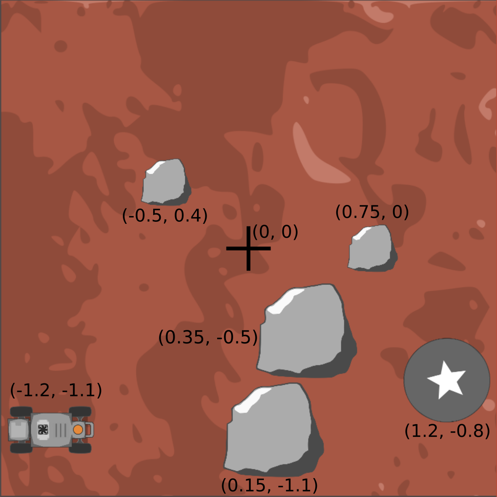

# TRIP TO MARS - A Block Based Programming Game Using the SVEA Vehicles
This project uses [blockly](https://developers.google.com/blockly/) which lets the user code a simple program to control a driver-less RC vehicle (KTH's SVEA cars). The user simulates the vehicle's path in a game environment in the browser, before trying it out the code on the car itself. The project is mainly written in JavaScript, HTML and Python.

## Intended Use
The web application in this repository is meant to be hosted from a laptop (running Ubuntu 16.04). This laptop will act as a server accessible on the local network. The game can then either be played in a browser window on the host computer itself, or any computer connected to the same network. The solution code the user generates when finishing the last level will be saved to the host computer. If a SVEA vehicle, with the required software, is connected to the same network it can access the code ( when a bash command is run) and the code is then executed on the vehicle. The car is meant to drive in a course which will be described later.
## Setting up the environment
The files in this repository have to be copied both to the intended host computer as well as the SVEA vehicle. Not all parts of the repository are used on both the host and the vehicle. In the following chapter we will explain how to set everything up on both machines.
### On the Host Computer
The project assumes you are running Ubuntu 16.04. and that you have the following applications installed on your machine:
* [ROS](https://www.ros.org/). You can install ROS by following [this guide](http://wiki.ros.org/kinetic/Installation/Ubuntu).
* [Node.js](https://nodejs.org/en/) and [npm](https://www.npmjs.com/). You can install them by following [this guide](https://tecadmin.net/install-latest-nodejs-npm-on-ubuntu/). Get the LTS release.

The python application requires numpy, matplotlib and demjson. Install them if you don't already have them.

	pip install numpy matplotlib demjson

Futhermore we recommend installing [nodemon](https://www.npmjs.com/package/nodemon) which simplifies debugging when you're testing out your applications.

	sudo npm install -g nodemon

Now clone the git repository

	git clone https://github.com/emmaj7/sml_summerproject.git

and go to it using the terminal. Go to the "svea_starter" folder.

	cd svea_starter

Delete the repositories called 'zed-ros-wrapper' and 'SVEA-arduino'. These are only used on the car. Now run

	rosdep install --from-paths src --ignore-src -r -y

to install all dependencies. Compile and link the ROS libraries

	catkin_make
	source devel/setup.bash
	rospack profile

To avoid having to source the setup file in the future, also call

	echo "source $PWD/devel/setup.bash" >> ~/.bashrc
	source ~/.bashrc

Finally you have to install all node.js app dependencies. Go into the folder called "myapp" and run

	npm install

You should now be good to go. Start the app on a local server by running:

	nodemon app.js

You can view the application by going into a browser and accessing

	localhost:3000

The app is also accessible from any other computer connected to the local network through

	<host-ip-address>:3000

### On SVEA Vehicle
The project assumes the SVEA vehicle has been flashed using Jetpack 3.3 (might work for later version but has not been tested) and is running Ubuntu 16.04. It also assumes that you have the following applications installed on your machine:
* [ROS](https://www.ros.org/). You can install ROS by following [this guide](http://wiki.ros.org/kinetic/Installation/Ubuntu).

The python application requires numpy, matplotlib and demjson. Install them if you don't already have them.

	pip install numpy matplotlib demjson

Now clone the git repository

	git clone https://github.com/emmaj7/sml_summerproject.git

and go to it using the terminal. If you want to, you can delete the content of the folder named 'myapp'. Its content is for the server application and isn't directly used unless the SVEA vehicle is also the host computer.
Go to the "svea_starter" folder.

	cd svea_starter

Now run

	rosdep install --from-paths src --ignore-src -r -y

to install all dependencies. Compile and link the ROS libraries

	catkin_make
	source devel/setup.bash
	rospack profile

	To avoid having to source the setup file in the future, also call

		echo "source $PWD/devel/setup.bash" >> ~/.bashrc
		source ~/.bashrc

For questions or problems related to the steering of the vehicle see [SVEA-Arduino repo](https://github.com/KTH-SML/SVEA-Arduino)

## Configuring the Zed Camera
On the SVEA vehicle, go to the folder named 'zed_wrapper' under 'svea_starter/src/zed-ros-wrapper'. Open 'params'.
In 'common.yaml' do
 	'two_d_mode' to true.
In 'zed.yaml' do
 	max_depth: 10.0

For questions or problems related to the zed camera see [zed git repo](https://github.com/stereolabs/zed-ros-wrapper).

## Configuring the Bash Scripts
The SVEA vehicle executes the python code saved to the host computer when a bash script is run.
The script copies the file containing the python code so that it can be executed on the SVEA car. To be able to access this file the script has to be configured correctly, according to the specifications of the host computer.

On the SVEA vehicle, open the script called 'run_car_script' located in the root of the repository. Locate the variable named 'IP_ADDRESS' and change its value to the ip-address of the host computer.

Also change the variable 'USER' into the user account of the host computer. Do the same for the bash script named 'run_default_script'. This bash file is very similar to the other one, but copies and executes a default python script instead of what the player wrote.

The SVEA vehicle will copy the file using the 'scp' command and thus needs the host computers password. On the SVEA vehicle, go into the folder named 'password' and change the content of 'password.txt' to the password of the host computer.

Finally, if you haven't already installed it, install openssh to make the host computer accessible over ssh

 	sudo apt-get install openssh-server openssh-client

## Using the Bash Scripts
The intended use of 'run_car_script' and 'run_default_script' is that they can be executed on the SVEA vehicle from the host computer using ssh. To connect to the svea car over ssh type

	ssh nvidia@<svea-ip-address>

To execute 'run_car_script' for example, go to the root of the repository and run

	bash run_car_script

## Assembling the Obstacle Course
The SVEA vehicle is supposed to drive around in a course which resembles the third level of the game. There are props in the Smart Mobility Lab that are meant to be used as boulders and goal. There are also red floor tiles in the lab which can be laid out and put together to resemble the mars surface.

To set it up in the same way please refer to the image below. The units in the image are in meters and the coordinates are in reference to the center of the map. The coordinates refer to the center points of the objects. The entire course is 3x3 meters. There are enough floor tiles in the lab to cover an area of 4x4 meters.

